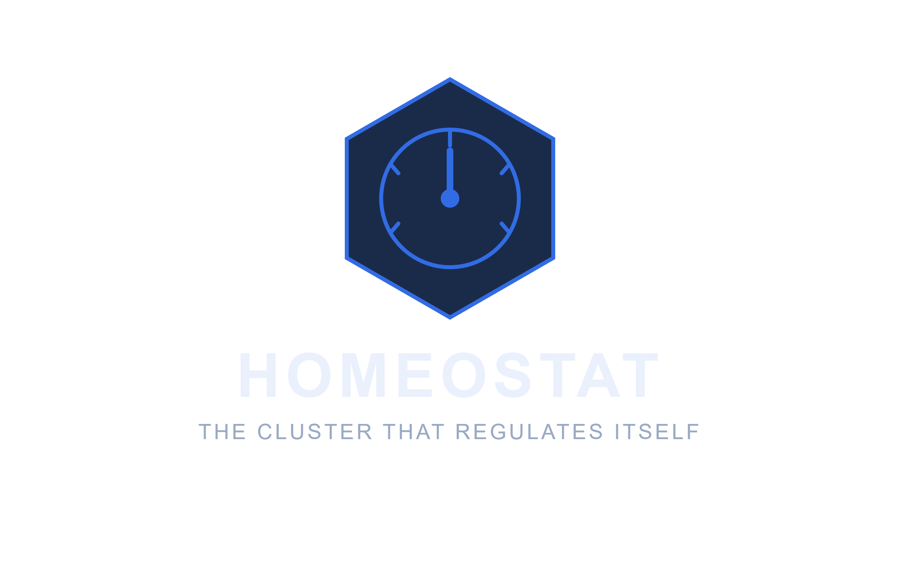

  

# Homeostat

**The cluster that regulates itself.**

Homeostat is an open-source, policy-governed autonomous optimization engine for Kubernetes. It combines AI agents ([kagent](https://kagent.dev)), policy-as-code guardrails ([Kyverno](https://kyverno.io)), and native autoscaling (HPA/VPA/Cluster Autoscaler) to continuously right-size workloads - safely, auditably, and without a SaaS dashboard.

> Status: early-stage / proof of concept. Not affiliated with or endorsed by kagent, Kyverno, or the CNCF.

More docs coming as the project takes shape.
